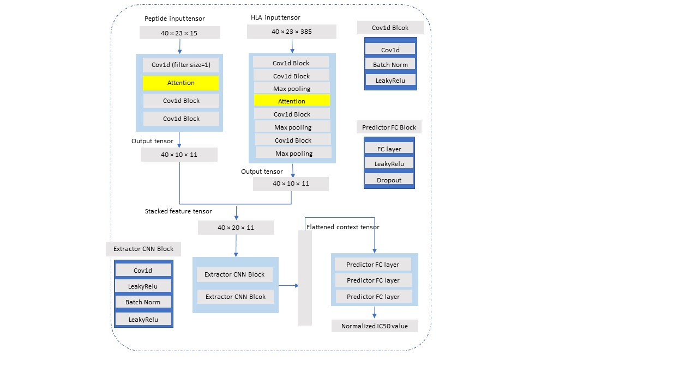

#  DeepAttentionPan: 

### Deep learning prediction of MHC-I peptide binding with attention mechanism

- Usage: the codes can be used to train our models, output results on the testing set, output positional attention weights for chosen group of peptides.  And  they also can be used to test on single hla-peptide pair input from the command line.

- Please download the full folder of "DeepAttentionPan_Code" to run the programs, or you may need to configure some directory paths.

- Platform: Python 3.6, need to use GPU to train,test and ouput attention weights.

### Testing: 

our final ensemble prediction model is stored in the "dup_0" folder, suppose now we want to output testing results of the final model in "dup_0".

1) In the file "dup_0/config.json", the "test_file" refers to the file name of the testing set. All the testing files also need to be stored in the folder "dataset". In the folder "dataset", the "testing_set.txt" is the testing set we used to compare our results with other IEDB benchmark algorithms.  
2) Back to the directory "codes". Run in the command line: 
   "python test.py dup_0/config.json". After the testing process finishing, the testing results will be output to "dup_0", which are "weekly_result.txt" in detail and "weekly_result_METRICS.txt" for final comparison results.
     
### Training: 

1) Build a new folder "dup_1" inside the folder 'codes'. "dup_1" will be the folder where the algorithm reads the file storing parameters and outputs the trained models.  
2) Copy the "config.json" in "codes/dup_0" to "dup_1". "config.json" is the file storing useful parameters and the source paths of input data. 
3) In the file "config.json", change the content of attribute "working_dir" to be "dup_1". You are free to change other parameters to test the effects. The "data_file" refers to the file name of the training set, e.g, "training_set.txt". All the data files should be stored in the folder "dataset". 
4) Back to the directory "codes". Run in the command line:  
   "python train.py dup_1/config.json". After the training process finishing, the networks will be output to "dup_1".

### binding position importance investigation using attention mechanism

To output the attention weights of certain group of peptides,  you can also use the "att_weight.py" from the trained model(e.g. the model stored in the "dup_0").

1) In the "dup_0", change the "test_file" to the name of the file containing the group of the samples that you want to output the average positional attention weights. In the folder "dataset", "testing_9length.txt" contains all the samples with peptides of 9 length in the testing set. And "testing_10length.txt" and "testing_11length.txt" refer to the samples with peptides of 10 length and 11 length correspondently.   
2) Back to the directory "codes". Run in command line: 
     "python att_weight.py dup_0/config.json". The average attention weights of the group will be output to "dup_0".
 
 ### predict binding affinity of a single hla-peptide pair input from the command line
 
 1) In the folder "codes", run in the command line: 
        python single_test.py  HLA-A*02:01 QIDVEKKIV
 2) Then the program will directly output the binding affinity of the hla-peptide pair
 
 

